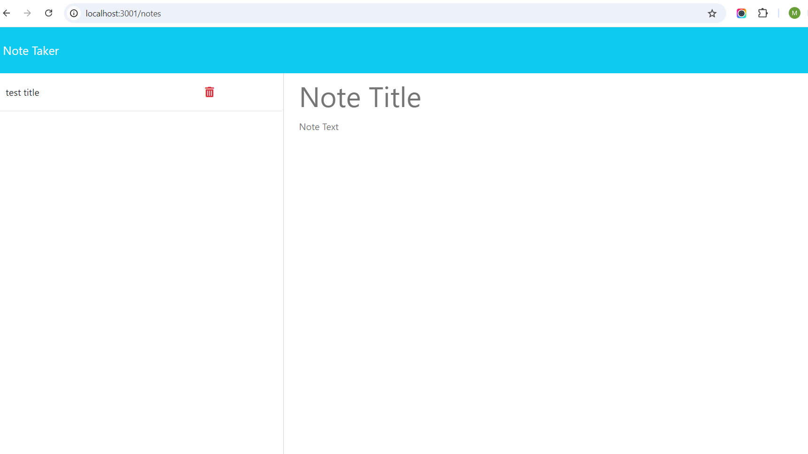

# Note Taker

## Description
An app that has a landing page and notes page where users can write and delete notes.
          
## Table of Contents
- [Installation](#installation)
- [Usage](#usage)
- [License](#license)
- [Questions](#questions)

## Installation
Use NPM to install [Express](https://www.npmjs.com/package/express)

## Usage
[Deployed Site](https://note-taker-tvp8.onrender.com)

## License

This project is licensed under the [MIT](https://opensource.org/licenses/MIT) license.
